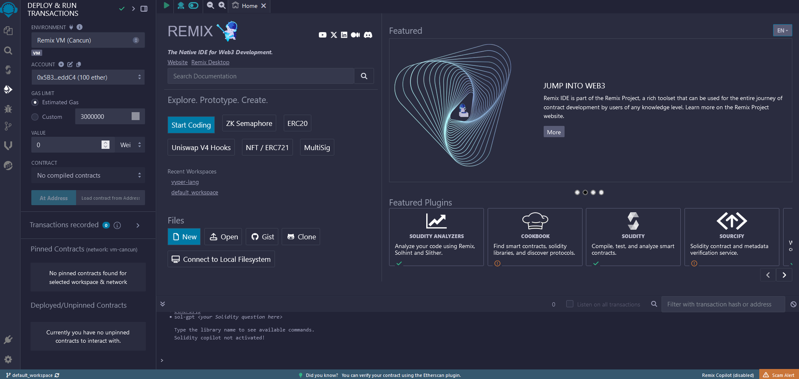

## Installation de MetaMask

### Pour Chrome et Firefox

1. **Visitez le site officiel de MetaMask** :
    - [MetaMask pour Chrome](https://chromewebstore.google.com/detail/metamask/nkbihfbeogaeaoehlefnkodbefgpgknn?hl=en)
    - [MetaMask pour Firefox](https://addons.mozilla.org/en-US/firefox/addon/ether-metamask/)
2. **Ajoutez l'extension à votre navigateur** :
    - Cliquez sur "Ajouter à Chrome" ou "Ajouter à Firefox".
    - Confirmez l'installation en cliquant sur "Ajouter l'extension".

## Configuration de MetaMask

1. **Ouvrez MetaMask** :
    - Cliquez sur l'icône MetaMask dans la barre d'outils de votre navigateur.
2. **Créer un nouveau portefeuille** :
    - Cliquez sur "Commencer".
    - Sélectionnez "Créer un portefeuille".
    - Créez un mot de passe sécurisé pour votre portefeuille.
    - Cliquez sur "Créer".
3. **Sauvegarder votre phrase de récupération** :
    - Vous recevrez une phrase de récupération de 12 mots. Notez-la et sauvegardez-la en lieu sûr.
    - Confirmez votre phrase de récupération en cliquant sur chaque mot dans l'ordre correct.
    - Cliquez sur "Confirmer".
4. **Votre portefeuille est prêt à être utilisé** :
    - Vous verrez votre adresse Ethereum et votre solde (probablement 0 ETH au début).
    - Vous pouvez maintenant envoyer, recevoir et gérer vos tokens Ethereum.

## Configuration de MetaMask pour les CTF (Ajout du réseau du CTF)

- **Ouvrir MetaMask** :
    - Cliquez sur l'icône MetaMask dans la barre d'outils de votre navigateur pour ouvrir l'extension.
- **Accéder aux Paramètres du Réseau** :
    - Cliquez sur le logo du réseau en haut au centre (par défaut, il peut indiquer "Ethereum Mainnet" ou un autre réseau).
    - Sélectionnez "Add Network" (Ajouter un réseau).
- **Ajouter un Réseau** :
    - Une nouvelle fenêtre s'ouvrira où vous pourrez entrer les détails du réseau personnalisé.
    - Remplissez les champs requis :
        - **Network Name** (Nom du réseau) : Le nom que vous souhaitez donner à ce réseau.
        - **New RPC URL** (Nouvelle URL RPC) : L'URL du RPC pour le réseau.
        - **Chain ID** : L'identifiant de la chaîne pour le réseau.
        - **Currency Symbol** (Symbole de la devise) : Le symbole de la devise du réseau (par exemple, ETH pour Ethereum).
        - **Block Explorer URL** (URL de l'explorateur de blocs) : (Optionnel) L'URL d'un explorateur de blocs pour le réseau.

---

# Premiers Pas sur Remix IDE

Remix IDE est un environnement de développement intégré pour le développement de contrats intelligents sur Ethereum. Voici comment l'utiliser pour écrire, compiler et déployer des contrats intelligents.


## Accéder à Remix IDE

1. **Ouvrez votre navigateur et accédez à Remix IDE**.

## Écrire un Smart Contract

1. **Créer un nouveau fichier** :
    - Dans le volet gauche, cliquez sur l'icône "+" pour créer un nouveau fichier.
    - Nommez le fichier `MyContract.sol`.
2. **Écrire un contrat intelligent simple** :
    
    ```solidity
    // SPDX-License-Identifier: MIT
    pragma solidity ^0.8.0;
    
    contract MyContract {
        string public greet = "Hello, World!";
    }
    
    ```
    

## Compiler le Contrat

1. **Sélectionnez le compilateur** :
    - Cliquez sur l'icône "Solidity" dans le volet de droite (représenté par une icône de sol).
    - Sélectionnez la version du compilateur appropriée (0.8.0 dans cet exemple).
2. **Compiler le contrat** :
    - Cliquez sur "Compile MyContract.sol".
    - Vérifiez qu'il n'y a pas d'erreurs de compilation.

## Déployer le Contrat

1. **Configurer le déploiement** :
    - Cliquez sur l'icône "Deploy & run transactions" (représentée par une icône de fusée).
    - Sélectionnez "JavaScript VM" dans l'option "Environment" pour déployer localement.
    - Assurez-vous que votre contrat est sélectionné dans le menu déroulant "Contract".
2. **Déployer** :
    - Cliquez sur "Deploy".
    - Votre contrat sera déployé et vous verrez l'adresse de déploiement dans la section "Deployed Contracts".

## Interagir avec le Contrat

1. **Voir les fonctions du contrat** :
    - Sous "Deployed Contracts", vous verrez votre contrat déployé.
    - Cliquez dessus pour voir les fonctions disponibles.
2. **Appeler une fonction** :
    - Cliquez sur `greet` pour exécuter cette fonction.
    - Vous devriez voir la sortie "Hello, World!".


# Connecter Metamask à Remix IDE

1. **Sélectionner l'Environnement de Déploiement**
    Dans Remix, allez dans l'onglet "Deploy & run transactions" (déployer et exécuter des transactions) sur le côté droit de l'écran (représenté par une icône de fusée).
    Dans la section "Environment", sélectionnez "Injected Web3". Cela permet à Remix d'utiliser MetaMask comme fournisseur Web3.

2. **Autoriser la Connexion à MetaMask**

    Une fois que vous avez sélectionné "Injected Web3", une fenêtre MetaMask apparaîtra pour vous demander de vous connecter. Sélectionnez le compte que vous souhaitez utiliser et autorisez la connexion.
    Vous verrez que l'environnement de Remix change pour afficher l'adresse de votre compte MetaMask connecté.

# Tutoriel additionnel
### Ajouter des Fonctions

Vous pouvez ajouter plus de fonctions à votre contrat pour interagir avec les utilisateurs.

```
pragma solidity ^0.8.0;

contract MyContract {
    string public greet = "Hello, World!";
    
    function setGreeting(string memory _greet) public {
        greet = _greet;
    }
}

```

### Compiler et Déployer de Nouveau

1. **Compiler le Contrat Mis à Jour** :
    - Recompilez le contrat après avoir ajouté les nouvelles fonctions.
2. **Déployer le Contrat Mis à Jour** :
    - Déployez de nouveau le contrat comme précédemment en utilisant "Injected Web3".

### Interagir avec les Nouvelles Fonctions

1. **Voir les Nouvelles Fonctions** :
    - Sous "Deployed Contracts", vous verrez votre contrat déployé avec les nouvelles fonctions.
2. **Appeler les Fonctions** :
    - Utilisez `setGreeting` pour changer le message de salutation.
    - Entrez un nouveau message dans le champ et cliquez sur `transact`.
    - Confirmez la transaction via MetaMask.
    - Appelez `greet` pour vérifier que le message a été mis à jour.
